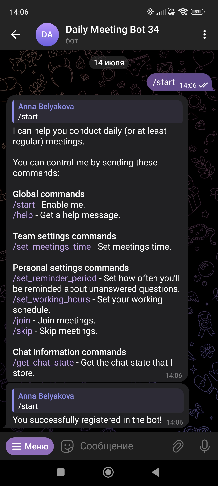
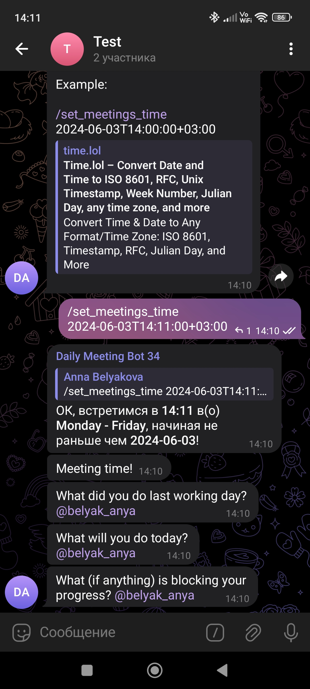
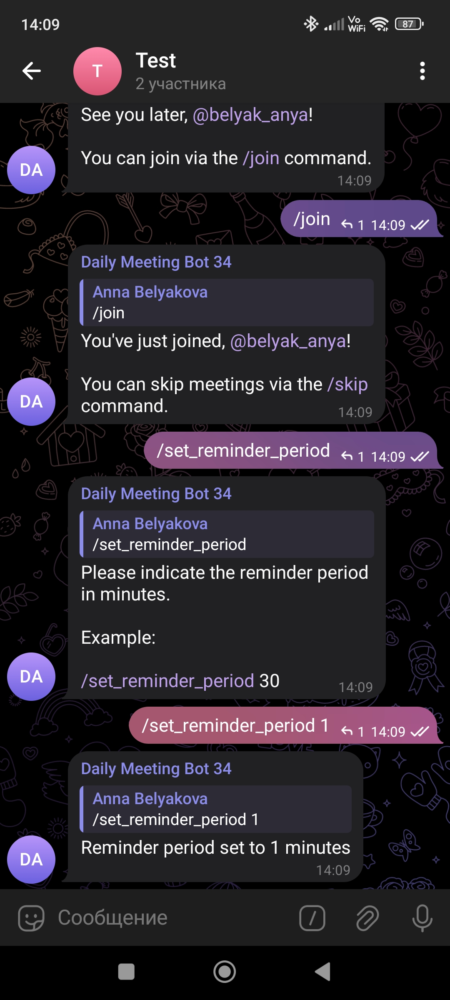
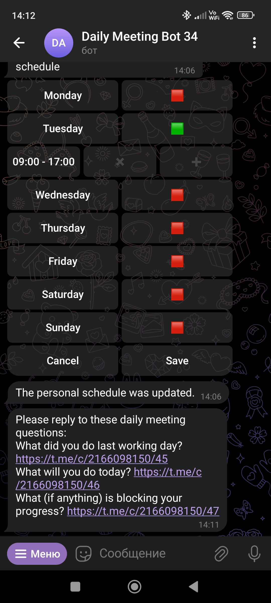
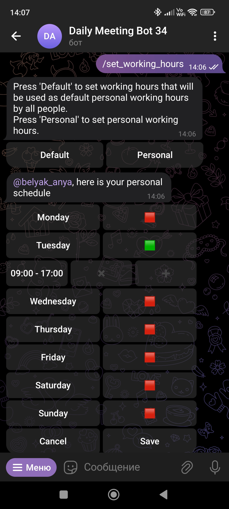

<a id="readme-top"></a>

[![Contributors][contributors-shield]][contributors-url]
[![Forks][forks-shield]][forks-url]
[![Issues][issues-shield]][issues-url]
[![MIT License][license-shield]][license-url]


<br />
<div align="center">

  <h3 align="center">Daily Meeting Telegram Bot</h3>
  
  [![Forks][Bot]][Bot-url]

  <p align="center">
    A Telegram bot that helps you conduct daily (or at least regular) meetings.
    <br />
    <a href="docs/"><strong>Explore the docs »</strong></a>
    <br />
    <br />
  </p>
</div>


<details>
  <summary>Table of Contents</summary>
  <ol>
    <li>
      <a href="#about-the-project">About The Project</a>
    </li>
    <li>
      <a href="#feature-list">Feature list</a>
    </li>
    <li><a href="#demo">Demo</a>
    <ul>
        <li><a href="#bot-functionality">Bot functionality</a></li>
        <li><a href="#supported-languages">Supported languages</a></li>
      </ul>
    </li>
    <li><a href="#built-with">Built With</a></li>
    <li><a href="#usage">Usage</a></li>
    <ul>
        <li><a href="#personal-use">Personal use</a></li>
        <li><a href="#teamwork">Teamwork</a></li>
      </ul>
    <li><a href="#launch-your-bot">Launch yout bot</a></li>
    <ul>
        <li><a href="#run-via-docker">Run via `docker`</a></li>
        <li><a href="#run-via-nix">Run via Nix</a></li>
      </ul>
    <li><a href="#contributing">Contributing</a></li>
    <li><a href="#develop">Develop</a></li>
    <ul>
        <li><a href="#requirements">Requirements</a></li>
        <li><a href="#setting-up-the-development-environment-using-vs-code">Setting up the development environment using VS Code</a></li>
        <li><a href="#i18n">I18N</a></li>
        <li><a href="#new-translations">New translations</a></li>
        <li><a href="#nix-flake">Nix flake</a></li>
      </ul>
    <li><a href="#license">License</a></li>
  </ol>
</details>

## About The Project

The bot is designed to solve problems that I encounter in life:
<ul>
<li> I have participated in too many projects that delivered less than they could have due to a lack of regular work from myself and my teammates. </li>
<li> I want a bot to remind me that I actually have to work on workdays.</li>
<li>I want everyone on my team to know each other's workdays.</li>
<li>In the morning, I don't care enough to ask my teammates about their progress, plans, and problems, so I want a bot to do that for me.</li>
<li>When I do care later, I can read through my teammates' messages and help them resolve their problems.</li>
</ul>

<p align="right">(<a href="#readme-top">back to top</a>)</p>

## Feature list

1. **Create a meeting**

   `/set_meetings_time`
   
     At the set time, the Bot will tag people who joined meetings who currently have working hours and ask daily questions.

2. **Set reminder period**

   `/set_reminder_period`
   
    If the User has not answered all the daily questions, the Bot will send him a reminder in private messages when the reminder period has passed since the last time the questions were sent.

3. **Set personal working hours**

   `/set_working_hours`
   
   Defines the time when the User participates in meetings.


4. **Chat language**

    `/set_language`
    
   When the User sets a specific chat language, the Bot communicates only in the set language.

5. **Default and personal time zone**

   `/set_default_time_zone`
   
   `/set_personal_time_zone`
   
   Affects the User's schedule and meetings time. If the User has not set personal working hours, the Bot uses the default one.

6. **Report for daily meeting**

   Upon request, the User can receive a report on today's meeting.

7. **Personal prefix for daily meetings**

   Allows the User to add a prefix that will be used during daily meetings.

8. **See overlapping working time for specific Users**
    
    `/get_overlapping_working_hours`

   Allows the User to request working hours crossing times from chat members.

9. **Creating recurring message**

    `/add_recurring_message`

   Allows the User to create a recurring message and set its title, start time, end time, sending frequency, and text content.

10. **Editing recurring message**

    `/edit_recurring _messages`
    
    Allows the User to edit the parameters of a recurring message by its name
    

11. **Task management**

    Allows the User to create a task with text, deadline, reminder period and responsible people

See roadmap [here](../../issues/79).
Details of the commands' work can be found in their [scenarios](docs/configuration/scenarios/)

<p align="right">(<a href="#readme-top">back to top</a>)</p>

## Demo

### Bot functionality

<div style="display: flex; flex-wrap: wrap; justify-content: center;">
  <div style="margin: 10px; text-align: center;">
    
    <br>
    <em>Start message</em>
  </div>
  <div style="margin: 10px; text-align: center;">
    
    <br>
    <em>Setting daily meeting time</em>
  </div>
  <div style="margin: 10px; text-align: center;">
    
    <br>
    <em>Setting reminder period</em>
  </div>
  <div style="margin: 10px; text-align: center;">
    
    <br>
    <em>Receiving reminders in PM</em>
  </div>
  <div style="margin: 10px; text-align: center;">
    
    <br>
    <em>Setting personal working hours</em>
  </div>
</div>


### Supported languages:
<ul>
<li>en</li>
<li>ru</li>
</ul>

<p align="right">(<a href="#readme-top">back to top</a>)</p>

## Built With

The Daily Meeting Telegram was built using:

* [![Python][Python.js]][Python-url]
* [![Aiogram][Aiogram.js]][Aiogram-url]
* [![MongoDB][MongoDB.js]][MongoDB-url]


<p align="right">(<a href="#readme-top">back to top</a>)</p>

## Usage
### Personal use:
Send [@daily_meeting_t34_bot](https://t.me/daily_meeting_t34_bot) a private message with the `/start` command.

### Teamwork:
Add [@daily_meeting_t34_bot](https://t.me/daily_meeting_t34_bot) to the public group. To gain access to all the functionality of the bot, send the `/start` command to the bot in private messages.

<p align="right">(<a href="#readme-top">back to top</a>)</p>

## Launch your bot

1. Create a bot via [@BotFather](https://t.me/botfather).

1. Write the environment variables to a `.env` file.

    ```console
    BOT_TOKEN=<bot token received from @BotFather>
    MONGO_HOST=mongodb
    MONGO_PORT=27017
    MONGO_USERNAME=some_unusual_username
    MONGO_PASSWORD=even_more_unusual_password
    ```

### Run via `docker`

```console
chmod +x scripts/up.sh
./scripts/up.sh
```

### Run via Nix

1. Install Nix - [link](https://github.com/DeterminateSystems/nix-installer#usage).

1. Run the bot.

    ```console
    nix run .#bot
    ```

<p align="right">(<a href="#readme-top">back to top</a>)</p>

## Contributing

- Suggest a new feature [here](../../issues/new?assignees=&labels=Architecture%2CProject+Documentation%2CUI%2FUX%2C%5BScenario%5D&projects=&template=scenario.yml&title=Scenario%3A+%7B%7Bscenario_description%7D%7D)

- Improve existing functionality/fix a bug/improve the UI, etc. [here](../../issues/new?assignees=&labels=%5BTask%5D&projects=&template=task.yml&title=%7B%7Btask_description%7D%7D)

<p align="right">(<a href="#readme-top">back to top</a>)</p>

## Develop

### Requirements

See [Requirements](./docs/requirements.md).

### Setting up the development environment using VS Code

The project describes scenarios using[statelyai.stately-vscode
](https://marketplace.visualstudio.com/items?itemName=statelyai.stately-vscode) extension for VS Code.

### I18N

[aiogram docs](https://docs.aiogram.dev/en/latest/utils/i18n.html)

Run:

```sh
chmod +x ./scripts/locales.sh
./scripts/locales.sh
```

### New translations

`bash ./scripts/locales.sh`

### Nix flake

Run `nix develop` and see available commands and tools.

<p align="right">(<a href="#readme-top">back to top</a>)</p>

## License

Distributed under the MIT License. See [LICENSE.txt](./blob/main/LICENSE)
 for more information.

<p align="right">(<a href="#readme-top">back to top</a>)</p>


[contributors-shield]: https://img.shields.io/github/contributors/team-work-tools/team-work-telegram-bot?style=for-the-badge&color=%238800ff
[contributors-url]: https://github.com/team-work-tools/team-work-telegram-bot/graphs/contributors

[forks-shield]: https://img.shields.io/github/forks/team-work-tools/team-work-telegram-bot?style=for-the-badge&color=%238800ff
[forks-url]: https://github.com/team-work-tools/team-work-telegram-bot/forks

[issues-shield]: https://img.shields.io/github/issues/team-work-tools/team-work-telegram-bot?style=for-the-badge&color=%238800ff
[issues-url]: https://github.com/team-work-tools/team-work-telegram-bot/issues

[license-shield]: https://img.shields.io/github/license/team-work-tools/team-work-telegram-bot?style=for-the-badge&color=%238800ff
[license-url]: https://github.com/team-work-tools/team-work-telegram-bot/LICENSE.txt

[Bot]: https://img.shields.io/badge/BOT-544987?style=for-the-badge
[Bot-url]: https://t.me/daily_meeting_t34_bot

[Python.js]: https://img.shields.io/badge/Python-8800ff?style=for-the-badge&logo=python&logoColor=white
[Python-url]: https://nextjs.org/

[Aiogram.js]: https://img.shields.io/badge/aiogram-544987?style=for-the-badge
[Aiogram-url]: https://aiogram.dev/

[MongoDB.js]: https://img.shields.io/badge/mongoDB-8800ff?style=for-the-badge&logo=mongoDB&logoColor=white
[MongoDB-url]: https://aiogram.dev/