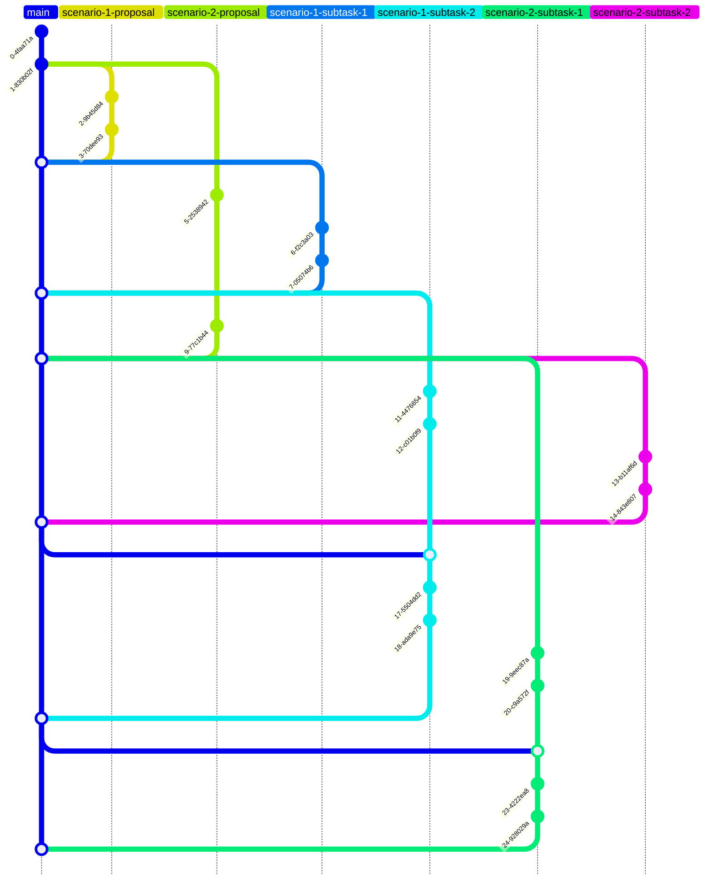

# Git workflow process

This document provides an overview of the Git workflow process used by contributors to this project.

## Process

### Basis

- Contributors use the [GitHub flow](https://docs.github.com/en/get-started/using-github/github-flow) process as a basis for the Git workflow process in this project.

### Issues

- Contributors use [issues](https://github.com/team-work-tools/team-work-telegram-bot/issues) to track tasks.
- There are four main kinds of issues:
  - [Scenario Proposal](https://github.com/team-work-tools/team-work-telegram-bot/issues?q=is%3Aissue+is%3Aopen+label%3A%22Scenario+Proposal%22) issues are used to propose new scenarios of interaction with the bot.
  - [Scenario Implementation](https://github.com/team-work-tools/team-work-telegram-bot/issues?q=is%3Aopen+is%3Aissue+label%3A%22Scenario+Implementation%22) issues are used to track implementation progress of corresponding `Scenario Proposal` issues.
  - Issues for subtasks of `Scenario Implementation` issues.
  - Other issues that aren't directly connected with scenarios.

### Branches

- Contributors use [branches](https://docs.github.com/en/pull-requests/collaborating-with-pull-requests/proposing-changes-to-your-work-with-pull-requests/about-branches) to work on particular issues.
- A branch for an issue must be created from the `main` branch via the `Create a branch` button in that issue.

### The `main` branch

- The `main` branch accumulates the work of contributors.
- The following Branch protection rules are enabled for the `main` branch:
  - [x] Require a pull request before merging
    - [x] Require approvals
      - > When enabled, pull requests targeting a matching branch require a number of approvals and no changes requested before they can be merged.
      - Required number of approvals before merging: 1
    - [x] Dismiss stale pull request approvals when new commits are pushed.
      - > New reviewable commits pushed to a matching branch will dismiss pull request review approvals.
    - [x] Require approval of the most recent reviewable push.
      - > Whether the most recent reviewable push must be approved by someone other than the person who pushed it.
  - [x] Require conversation resolution before merging.
    - > When enabled, all conversations on code must be resolved before a pull request can be merged into a branch that matches this rule.

### Pull requests

- Pull requests must target the `main` branch.
- Pull requests for `Scenario Proposal` issues must be reviewed and merged before pull requests for corresponding `Scenario Implementation` and subtask issues.
- Contributors that work on a pull request in a branch `<branch name>` must periodically merge the `main` branch into `<branch name>`:
  - To synchronize with the latest project state
  - To resolve conflicts between `<branch name>` and `main` before merging the `<branch name>` to `main`.

### Commits

- Commit messages must follow the [Conventional Commits](https://www.conventionalcommits.org/en/v1.0.0/) specification.

## Sample git graph diagram

The diagram above shows the following branches:

- The `main` branch.
- Branches for `Scenario Proposal` issues: `scenario-1-proposal`, `scenario-2-proposal`.
- Branches for subtask issues: `scenario-1-subtask-1`, `scenario-1-subtask-2`, `scenario-2-subtask-1`, `scenario-2-subtask-2`.

The `scenario-1-subtask-1`, `scenario-1-subtask-2` branches were merged after the `scenario-1-proposal` branch had been merged.

The `scenario-2-subtask-1`, `scenario-2-subtask-2` branches were merged after the `scenario-2-proposal` branch had been merged.

There `main` branch had been merged into `scenario-1-subtask-2` and `scenario-2-subtask-1` before these branches for subtasks were ready to be merged into the `main` branch.
