## Glossary

The words "MUST", "MUST NOT", "REQUIRED", "SHALL", "SHALL NOT", "SHOULD", "SHOULD NOT", "RECOMMENDED", "NOT RECOMMENDED", "MAY", and "OPTIONAL" in this document are to be interpreted as described in RFC2119 [^RFC2119] and RFC8174 [^RFC8174] when, and only when, they appear in all capitals, as shown here.

- **Regular meetings** - meetings that occur every week.

## Nonfuncional requirements

As per [ISO/IEC 25010](https://iso25000.com/index.php/en/iso-25000-standards/iso-25010).

- Performance Efficiency
  - Time Behavior
    - The bot MUST respond to messages in under 0.5 seconds.
- Functional Suitability
  - Functional correctness
    - The bot MUST have no states where it gets stuck and can't respond.
  - Functional Completeness
    - The bot MUST support all commands specified in the [Commands](#commands) section.

## Functional requirements

### Stack

- Programming language:
  - `Python`
- Libraries:
  - `aiogram` - for the bot
  - `Babel` - for i18n
- Database:
  - `MongoDB`
- Deployment
  - `docker-compose`
- Dev environment
  - `Nix` package manager
  - `poetry` package manager

### i18n

- Languages:
  - `Ru`
  - `En`
- Support extending this list via message catalogs ([link](https://babel.pocoo.org/en/latest/cmdline.html)).

### Commands

#### Types

- Interactive command - The bot MUST reply to the sent command and prompt the command sender to perform some actions.
- Non-interactive command - The bot MUST NOT prompt the sender to do some actions. The bot MAY reply to the sent command.

#### Global commands

[Telegram docs](https://core.telegram.org/bots/features#global-commands)

- `/start` - (interactive) Start the bot.
- `/help` - (non-interactive) Get a help message.
- `/stop` - (non-interactive) Stop the bot.
- `/cancel` - (non-interactive) Cancel the current operation.

#### Team settings

- `/set_up_meeting` - (interactive) Set up regular meeting time zone, time, workdays.
- `/set_time_zone` - (interactive) Set the team's time zone.
- `/set_meeting_time` - (interactive) Set the regular meeting time.
- `/set_team_workdays` - (interactive) Set the team's workdays.

#### Personal settings

- `/join` - (non-interactive) Order the bot to mention the command sender during regular meetings.
- `/leave` - (non-interactive) Order the bot to not mention the command sender during regular meetings.
- `/set_my_workdays` - (interactive) Order the bot to mention the command sender during regular meetings only on the specific days.
- `/join_today` - (non-interactive) Order the bot to mention the command sender during today's regular meeting or immediately if the meeting is over.
- `/leave_today` - (non-interactive) Order the bot to not mention the command sender during today's regular meeting.
- `/set_vacation` - (interactive) Order the bot to not mention the command sender during a specific period.
- `/unset_vacation` - (interactive) Order the bot to remove the info about the vacation of the command sender.

##### Notes

- There can be at most one vacation for a person at each moment.

### Dialog scenarios

```mermaid
flowchart LR
    subgraph "[Scenario: use the bot]"
    
      subgraph "[Scenario: Choose a command]"
        u090(User) == "[Action: choose /start]" ==> u100(User)
        u090(User) == "[Action: choose /help]" ==> u13308(User)
        u090(User) == "[Action: choose /stop]" ==> u13309(User)
      end
      
      subgraph "[Scenario: Start the bot]"
        u100(User) == "[Command: /start]" ==> u200(Bot)
        u200(Bot) == "[Message: ...Help message...]" ==> u210(Bot)
        
        subgraph "[Scenario: Set up meeting]"
          u210(Bot) =="[Message: Let's set up your meetings. I need to know your time zone, meeting time in that time zone, and your team's workdays.]"==> u300(Bot)
          subgraph "[Scenario: Set time zone]"
            u300(Bot) == "[Message: Let's set the time zone for your meetings. Click the button below.]
                          [Button: Select a time zone]" ==> u400(User)
            u400(User) == "[Action: Click the button]" ==> u500(Bot)
            u400(User) == "[Command: /cancel]" ==> u600(Bot)
            u600(Bot) == "[Message: OK. Send me later the /set_time_zone or the /set_up_meeting command.]" ==> u700(User)
            
            u500(Bot) == "[Inline query: @{bot_name} current time [Placeholder: HH:MM]]" ==> u800(User)
            u800(User) == "[Action: Type in the time in HH:MM format]" ==> u900(Bot)
            u900(Bot) == "[Result: Time zone found]" ==> u1000(Bot)
            u900(Bot) == "[Result: Time zone not found]" ==> u1100(Bot)
            u1000(Bot) == "[Action: Show a filtered list of time zones]" ==> u1200(User)
            u1200(User) == "[Action: Continue typing]" ==> u900(Bot)
            u1200(User) == "[Action: Select a time zone]" ==> u1300(Bot)
            u1200(User) == "[Action: Clear the input], [Command: /cancel]" ==> u600(Bot)
            u1300(Bot) == "[Internal action: Write the time zone into a database]" ==> u1400(Bot)
          end

          u700(User) ==> u1500(User)
          u1400(Bot) ==> u1600(Bot)

          subgraph "[Scenario: Set meeting time]"
            u1600(Bot) == "[Message: Click the button and type the meeting time in HH:MM, 24-hour format. Next, select an option.]
                            [Button: Set the meeting time]" ==> u1700(User)
            u1700(User) == "[Command: /cancel]" ==> u1800(Bot)
            u1800(Bot) == "[Message: OK. Send me later the /set_meeting_time or the /set_up_meeting command]" ==> u1900(User)
            u1700(User) == "[Action: Click the button]" ==> u2000(Bot)
            
            u2000(Bot) == "[Inline query: @{bot_name} select time [Placeholder: HH:MM]]" ==> u2100(User)
            u2100(User) == "[Action: Type in the time in HH:MM format]" ==> u2200(Bot)
            u2200(Bot) == "[Result: Meeting time found]" ==> u2300(Bot)
            u2200(Bot) == "[Result: Meeting time not found]" ==> u2400(Bot)
            u2300(Bot) == "[Action: Show a filtered list of meeting times]" ==> u2500(User)
            u2500(User) == "[Action: Continue typing]" ==> u2200(Bot)
            u2500(User) == "[Action: Select a meeting time]" ==> u2600(Bot)
            u2500(User) == "[Action: Clear the input], [Command: /cancel]" ==> u1800(Bot)
            u2600(Bot) == "[Internal action: Write the meeting time into a database]" ==> u2700(Bot)
          end

          u1900(User) ==> u1500(User)
          u2700(Bot) ==> u2800(Bot)

          subgraph "[Scenario: Set team workdays]"
            u2800(Bot) == "[Message: Please select the team's workdays. Click the button below.]
                          [Button: Set the team's workdays]" ==> u2900(User)
                          
            u2900(User) == "[Action: Click the button]" ==> u3000(Bot)
            
            u3000(Bot) == "[Keyboard: 
                            [Title: Set the team's workdays]
                            [Button: Monday], [Button: Tuesday], [Button: Wednesday], 
                            [Button: Thursday], [Button: Friday], 
                            [Button: Saturday], [Button: Sunday], [Button: Confirm]]" ==> u3100(User)
                            
            u3100(User) == "[Action: Click on days]" ==> u3200(Bot)
            u3100(User) == "[Command: /cancel]" ==> u3300(Bot)
            
            u3300(Bot) == "[Message: OK. Send me later the /set_team_workdays or the /set_up_meeting command.]" ==> u3400(User)
            
            u3200(Bot) == "[Internal action: Collect selected days]" ==> u3500(Bot)
            
            u3500(Bot) == "[Keyboard: Confirm]" ==> u3600(User)
                            
            u3600(User) == "[Action: Click Confirm]" ==> u3700(Bot)
            u3600(User) == "[Command: /cancel]" ==> u3300(Bot)
            
            u3700(Bot) == "[Internal action: Write the team workdays into a database]" ==> u3800(Bot)
            u3800(Bot) == "[Message: The team's workdays are set as follows: [selected days].]" ==> u3900(User)
          end

          u3400(User) ==> u1500(User)
          u3900(User) ==> u1500(User)
        end
        
        u1500(User) ==> u4000(User)
      end
      
      u4000(User) ==> u4100(User)

      subgraph "[Scenario: Help]"
        u13308(User) == "[Command: /help]" ==> u23339(Bot)
        u23339(Bot) == "[Message: ...Help message...]" ==> u23340(User)
      end

      u23340(User) ==> u4100(User)

      subgraph "[Scenario: Stop]"
        u13309(User) == "[Command: /stop]" ==> u23341(Bot)
        u23341(Bot) == "[Message: The bot has been stopped.]" ==> u23342(User)
      end
      
      u23342(User) ==> u4100(User)
    end
```

Why these questions - [link](https://geekbot.com/blog/daily-standup-questions/).

From [here](https://www.agilealliance.org/glossary/three-qs/):

- `@username, what did you do last working day?`
- `@username, what will you do today?`
- `@username, what (if anything) is blocking your progress?`
